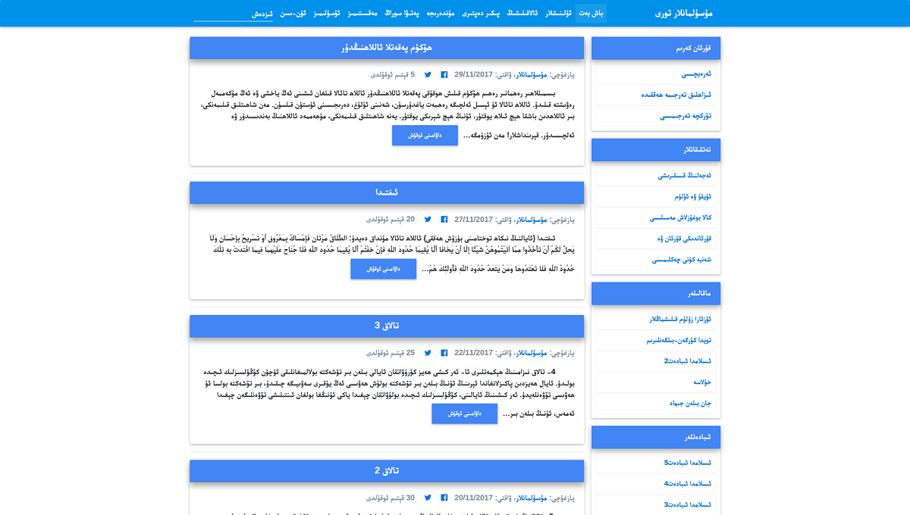

# yeni theme
This is a WordPress Blog theme for uyghur language websites developed on Material Design for Bootstrap 4

### Theme details:
* Theme Name: Yeni
* Theme URI: https://www.musulmanlar.com 
* Description: This is outstanding WP Blog theme developed on Material Design for Bootstrap 4
* Version: 1.0
* Author: Namsiz
* Author URI: https://www.musulmanlar.com/?author=101011
* License: GNU General Public License v2 or later
* License URI: https://www.gnu.org/licenses/gpl-2.0.html
* Text Domain: Yeni
* Tags: one-column, two-columns, right-sidebar, flexible-header, accessibility-ready, custom-colors, custom-header, custom-menu, custom-logo, editor-style, featured-images, footer-widgets, post-formats, rtl-language-support, sticky-post, theme-options, threaded-comments, translation-ready

ScreenShot      
